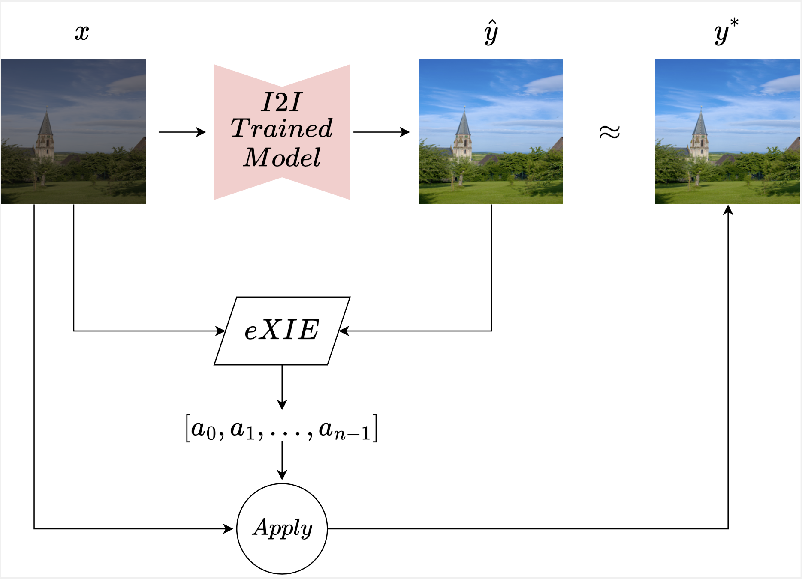
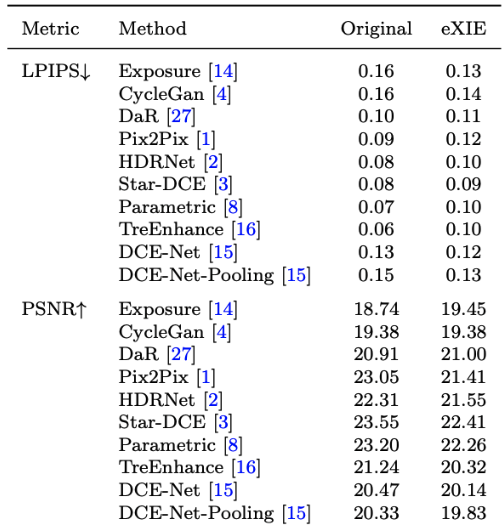
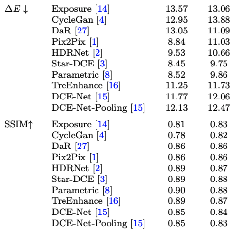
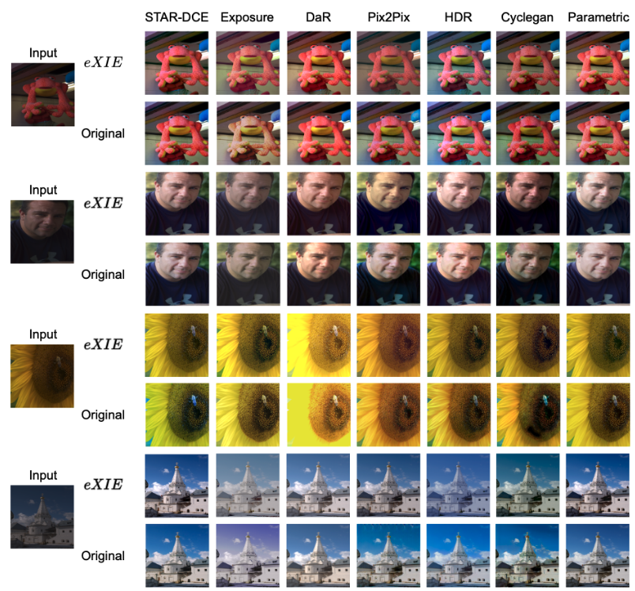
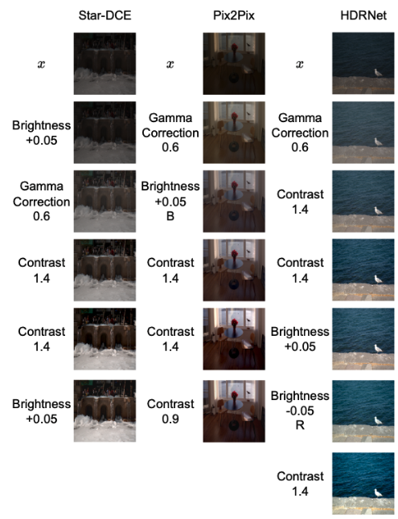

# Explaining Image Enhancement Black-Box Methods through a Path Planning Based Algorithm

Official Repo of the paper "Explaining Image Enhancement Black-Box Methods through a Path Planning Based Algorithm". 

[Marco Cotogni](https://scholar.google.com/citations?user=8PUz5lAAAAAJ&hl=it) and [Claudio Cusano](https://scholar.google.com/citations?hl=it&user=lhZpU_8AAAAJ&view_op=list_works&sortby=pubdate)

[](https://arxiv.org/pdf/2207.07092.pdf) []() 

**ACCEPTED in Multimedia Tools and Applications**

eXIE is an algorithm for explaining the results of state-of-the-art image-to-image
translation methods, used for natural image enhancement. Despite their high
accuracy, these methods often suffer from limitations such as artifact generation
and scalability to high resolutions, and have a completely black-box approach
that does not provide any insight into the enhancement processes applied.

eXIE solves this issue by providing a step-by-step explanation of the output
produced by existing enhancement methods, using a variant of the A* algorithm to
emulate the enhancement process through the application of equivalent enhancing
operators.

This algorithm has been applied to several state-of-the-art models trained on
the Five-K dataset, and has produced sequences of enhancing operators that
produce results that are very similar in terms of performance and overcome the
poor interpretability of the best-performing algorithms.

<p align="center">

</p>

## Requirements
python > 3.7, PyTorch, Torchvision, PIL, numpy

## Datasets
Download the [Five-K](https://data.csail.mit.edu/graphics/fivek/) datasets.
Once the dataset has been downloaded, split the data in training (4000)
and test(1000) using the files train1+2-list.txt and test-list.txt

## Reproducing the Experiments
### eXIE experiments
In order to reproduce the experiments contained in our paper, you need to obtain the 
1000 test images from the fivek dataset with one image enhancement method.
Then, you need to run the eXIE algorithm on each image, using the corresponding
enhancement method as the target model. The results will be saved in the 
eXIE_results folder.

This is the organization of the folders:

``` 
├── Basedir
│   ├── raw
│   │   ├── 0000.png
│   │   ├── ...
│   │   └── 4999.png
│   ├── expC
│   │   ├── 0000.png
│   │   ├── ...
│   │   └── 4999.png
│   ├── method_results
│   │   ├── XXXX.png
│   │   ├── ...
│   │   └── XXXX.png
│   ├── eXIE_results
│   ├── test-list.txt
│   └── train1+2-list.txt
```

In order to execute the eXIE algorithm, you need to run the following command:

```
python3 eXIE.py --basedir <BASEDIR> --expname <EXPNAME> -m <method> -t <THRESHOLD> -s <STEPS>
```
  
  where:
  - BASEDIR is the path to the folder containing the raw images, the test-list.txt and the train1+2-list.txt files
  - EXPNAME is the name of the experiment
  - method is the name of the searching algorithm (Dijkstra, Best Greedy or eXIE)
  - THRESHOLD is the threshold used to stop the searching algorithm
  - STEPS is the number of nodes expanded by the searching algorithm

### UNet experiments
It is possible to generate the images with a simple I2I method based on UNet.
In order to do that, you need to run the following command:

```
python3 train.py --exp_name <EXP_NAME>  --basedir <BASEDIR> -s <SIZE> -e <EPOCHS> -l <LR> -b <BS> -d <DO>
```
where:
  - BASEDIR is the path to the folder containing the raw images, enhanced images from the expert C, the test-list.txt and the train1+2-list.txt files
  - EXPNAME is the name of the experiment
  - SIZE is the size of the images
  - EPOCHS is the number of training epochs
  - BS is the batch size
  - DO is the dropout applied to the unet

Once the model has been trained (the best model is saved in ``` ./ckt/best_' + args.exp_name + '.pt'```) the test images can be obtained with:

```
python3 test.py --exp_name <EXP_NAME>  -s <SIZE> 
```

The test images can be found in ```Method_results```.


## Results

### Quantitative Results
<p float="left">
  
  
</p>

### Qualitative Results
<p float="left">
  
  
</p>

## Reference
If you are considering using our code, or you want to cite our paper please use:
```
@article{cotogni2022explaining,
  title={Explaining Image Enhancement Black-Box Methods through a Path Planning Based Algorithm},
  author={Cotogni, Marco and Cusano, Claudio},
  journal={arXiv preprint arXiv:2207.07092},
  year= {2022}
}
```